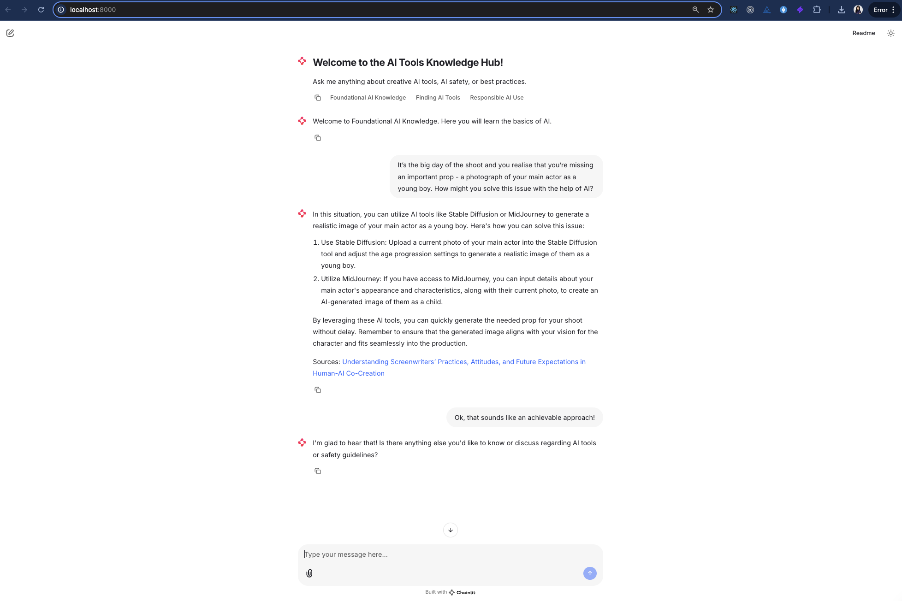

## Application Overview

Here's a visual of how the AI Tools Knowledge Hub looks:



# AI Tools Knowledge Hub

Welcome to the AI Tools Knowledge Hub, an interactive platform designed to assist film and TV professionals in responsibly using AI technologies. This application provides tailored advice and training on creative AI tools like Stable Diffusion and MidJourney, along with AI safety guidelines.

## Features

- **Foundational AI Knowledge**: Learn the basics of AI and its applications in the creative industry.
- **Finding AI Tools**: Discover various AI tools that can enhance your creative projects.
- **Responsible AI Use**: Understand ethical practices and safety guidelines for using AI in your work.

## Technologies Used

- **Python**: Backend logic and data processing.
- **Chainlit**: Interactive chat interface.
- **MongoDB**: Database for storing and retrieving information.
- **Langchain**: Integration with AI models for generating responses.

## Key Components

- **Prompt Templates**: Customizable prompts to tailor responses based on user roles and project details.
- **Memory Management**: Conversation context is managed using `ConversationBufferMemory`.
- **Action Handling**: Sidebar actions allow users to switch between different modes of learning and reset conversations.

## Data Preparation

- **Data Loading**: Utilizes `load_data.py` to process and load data into MongoDB.
- **Document Processing**: Converts CSV data into LangChain Document objects for efficient retrieval and embedding.

## Data and Model Usage

I've created and tested a sample dataset by scraping the web to gather relevant information. This data is processed to create embeddings, allowing for efficient retrieval of the closest matching documents. The application uses the following models via API:

- **OpenAI Models**: Utilized for generating embeddings and processing natural language queries.
- **Langchain**: Integrated for managing document chains and retrieval processes.

This setup enables the application to provide accurate and contextually relevant responses to user queries.

## Setup Instructions

1. **Clone the Repository**:

   ```bash
   git clone https://github.com/yourusername/ai-tools-knowledge-hub.git
   cd amici-knowledge-hub
   ```

2. **Set Up the Backend**:

   ```bash
   # Create and activate virtual environment
   python -m venv venv
   source venv/bin/activate  # On Windows: .\venv\Scripts\activate

   # Install dependencies using uv
   uv sync
   ```

3. **Environment Variables**:

   - Create a `.env` file and add your configuration details (e.g., API keys, database URIs).

4. **Prepare Data**:

   - Run the data preparation script:

   ```bash
   python prepare_data.py
   ```

5. **Load Data**:

   - Load the prepared data into the database:

   ```bash
   python load_data.py
   ```

6. **Run the Application**:
   ```bash
   python main.py
   ```

## License

This project is licensed under the MIT License.
